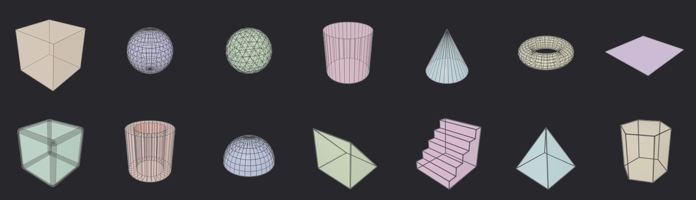

# Primitive Assets Library

A free **Blender Asset Library** of clean, ready-to-drag primitive shapes and a small
hard-surface kit — the same idea as *Modern Primitives* / *ND Primitives*, but shipped
as an **Asset Browser library** instead of an add-on. No Python, no operators: just a
`.blend` file with everything already marked as an asset, tagged, catalogued and
thumbnailed.



## What's inside

One file, `assets/primitives.blend`, containing 14 assets in two catalogs:

**Base** — the classic primitives, clean topology, sensible smoothing
- **Cube** — parametric (see below), Sphere, Ico Sphere, Cylinder, Cone, Torus, Plane

**Hard Surface Kit** — kitbash-ready pieces with a light bevel baked in
- Rounded Cube, Tube (hollow cylinder), Dome (half-sphere), Wedge, Stairs, Pyramid, Hex Prism

Every asset has a rendered preview thumbnail (shaded + wireframe overlay, so topology
reads at a glance), a description and search tags, and lives in its catalog so it
shows up correctly in the Asset Browser's catalog tree.

### Parametric primitives (Cube)

The Cube ships as a **Collection asset** (not a plain Object asset) named "Cube",
containing:

- the **Cube object** — no fixed mesh, a Geometry Nodes modifier (`Modern Cube`,
  generated by `build_cube_gn_group()` in `scripts/build_library.py`) exposing:
  - **Size** (X/Y/Z) — drag the arrow gizmos on the +X/+Y/+Z faces, or type a value
    in the modifier panel
  - **Division X/Y/Z** — drag the ring gizmos at the same faces, or type a value
  - **Corner Ratio** — moves the pivot anywhere from center to a corner; also has
    its own 3-axis move gizmo (translation only)
  - **Smooth** / **Smooth Angle** — shading, via Blender's bundled *Smooth by Angle*
  - **Material** — swappable like any modifier input
- 3 child **Empty (Single Arrow)** objects, one per Division ring, showing which
  way to turn it to increase the value — Blender's native dial gizmo has no
  built-in direction marker, so these fill that gap. They're real Empties (never
  render, viewport-only, like the gizmos themselves), parented to the Cube, placed
  to match the *default* Size/Division/Corner Ratio layout. If you resize the cube
  a lot they'll stay put rather than tracking the rings (a plain Empty's transform
  isn't modifier-driven) — good enough as a one-time "which way do I turn this"
  hint, not meant to be dynamically accurate. If a ring still turns the "wrong"
  way relative to its arrow, flip `tangent_axis = (i + 2) % 3` to `(i - 1) % 3`
  in `add_division_arrows()`.

The Size/Division gizmos are plain node-group *data*
(`GeometryNodeGizmoLinear`/`GeometryNodeGizmoDial`), the same mechanism *Modern
Primitives*/*ND Primitives* use internally — no add-on needed, survives
drag-and-drop as-is. The **arrows need the Collection asset**, though: dragging a
bare *Object* asset from the browser does not bring its parented children along,
only a Collection does. That's why Cube is packaged this way instead of as a
straight Object asset like the other 13 shapes (still static meshes for now — same
GN treatment planned for them later).

## Installing it as an Asset Library

There are two ways to hook this up in Blender, depending on your version.

### Option A — Remote Asset Library (Blender 5.2+, no download step)

Blender 5.2 added genuine remote asset libraries: point it at a URL and it fetches
the catalog listing, thumbnails and `.blend` data on demand, no `git clone` required.
This repo ships the `_asset-library-meta.json` / `_v1/` index that format needs,
generated straight from `primitives.blend` (see below), so you can add it as:

```python
import bpy
bpy.ops.preferences.asset_library_add(
    remote_url="https://raw.githubusercontent.com/pesaksintondji/primitive-assets-library/master/assets/",
    type='REMOTE',
)
```

Run that once in Blender's Python console (or `Scripting` tab), then check
**Edit ▸ Preferences ▸ File Paths ▸ Asset Libraries** — a *Primitive Assets Library*
entry should appear, marked as a remote (globe icon) library.

> The URL has to point at the folder that directly contains
> `_asset-library-meta.json` — that's `.../primitive-assets-library/master/assets/`,
> not the repo root, and not the `github.com` page (which serves HTML, not raw
> files — that's the mistake that produces a "file does not exist ... meta.json"
> error).

### Option B — Local folder library (any Blender version with Asset Browser)

1. Get the repo onto your disk — either clone it:

   ```bash
   git clone https://github.com/pesaksintondji/primitive-assets-library.git
   ```

   or, if you just want the single `.blend` file, download it directly from its raw
   GitHub URL:

   ```bash
   curl -L -o primitives.blend \
     https://raw.githubusercontent.com/pesaksintondji/primitive-assets-library/master/assets/primitives.blend
   ```

   (Grab `blender_assets.cats.txt` from the same `assets/` folder too if you want the
   catalog names/tree to resolve — Blender falls back to "Unassigned" without it.)

2. In Blender: **Edit ▸ Preferences ▸ File Paths ▸ Asset Libraries ▸ +**
3. Name it (e.g. *Primitives*) and point the path at the `assets/` folder (the one
   containing `primitives.blend` and `blender_assets.cats.txt`) — if you only
   downloaded the loose `.blend`, point it at whatever folder you saved it in instead.
4. Open the Asset Browser (or the Asset Shelf in the 3D Viewport), pick your new
   library from the source dropdown, and drag any shape straight into your scene.

Update later with `git pull` — Blender picks up changes to the library folder
automatically, no re-linking needed.

## Regenerating the library

The whole `.blend` is generated by one script, so nothing here was hand-authored or
needs a GUI session to edit:

```bash
blender --background --python scripts/build_library.py
```

This rebuilds every mesh, re-applies shading/bevels, re-renders each preview thumbnail
and re-marks everything as an asset with the same catalog UUIDs — safe to re-run any
time, e.g. after editing `scripts/build_library.py` to add a new shape or tweak a
dimension.

To add a new asset: append a `dict(...)` entry to the `ASSETS` list in
`scripts/build_library.py` (mesh builder callable, category, shading mode, optional
bevel, description, tags) and re-run the script.

After that, regenerate the remote index (Option A above reads this, not the raw
`.blend`) so it picks up the new/changed assets and thumbnails:

```bash
./scripts/generate_remote_index.sh
```

It shells out to `blender -c asset_listing generate assets`, which re-scans
`primitives.blend` and rewrites `_asset-library-meta.json`, `_v1/*.json` and the
per-asset `.webp` thumbnails in `assets/primitives_thumbnails/`. It preserves the
library `name`/`contact` you've set in `_asset-library-meta.json` across re-runs.

## License

Assets and scripts are released under [CC0 1.0](LICENSE) — public domain, use them in
anything, no attribution required.
